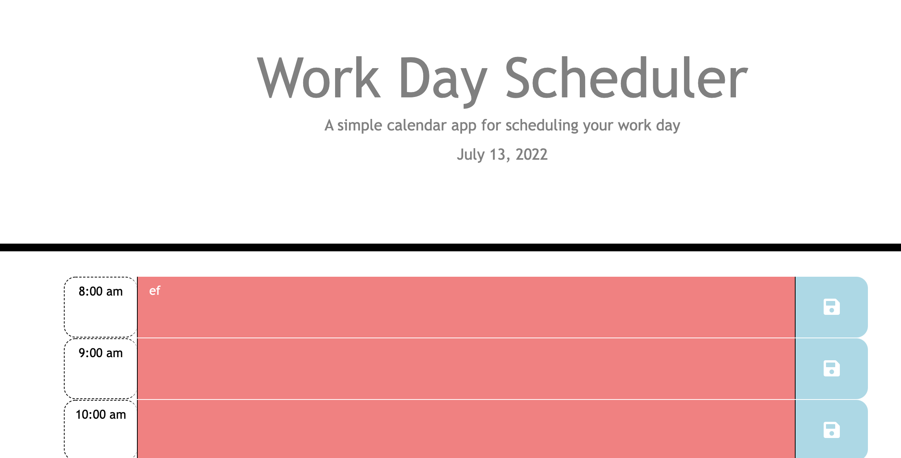

# Work Day Scheduler Starter Code
Using Third-Party APIs we created a work day scheduler.   

## Purpose 
This website allows a busy employee better organize their daily schedule and manage their time.

## Description
The emloyee will first open the planner and see the current day is displayed at the top of the calendar. While scrolling the screen displays time blocks for standard business hours. Each time block is color-coded to indicate whether it is in the past, present, or future. When the user clicks into a time block, they can enter and save an event for that time block. When the page is refreshed saved events persist. 

## Built with 
    *HTML 
    *CSS 
    *JavaScript
    *Bootstrap
    *moment.js
    *jQuery

## Website
 https://mtheofield.github.io/Work-Day-Scheduler/

## GitHub repository
https://github.com/mtheofield/Work-Day-Scheduler

Contribution
Made with Mary Theofield 

